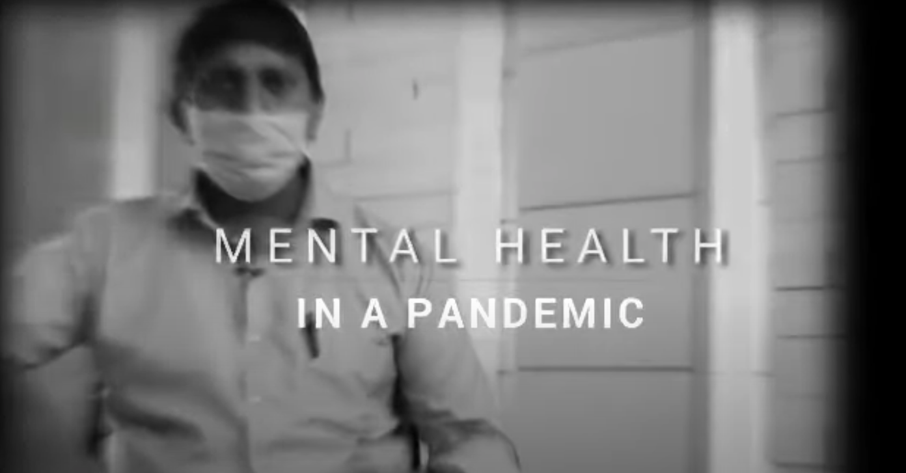
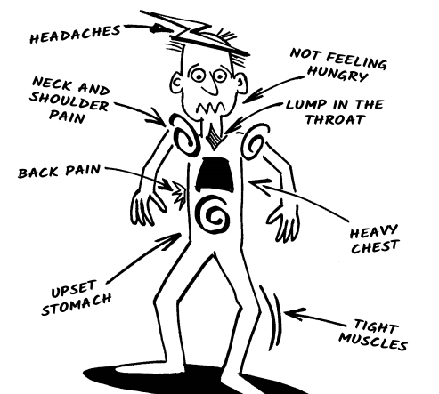
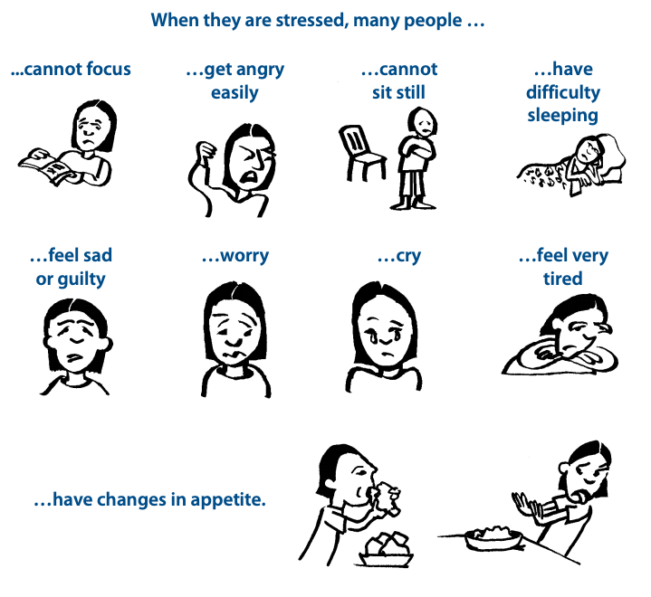
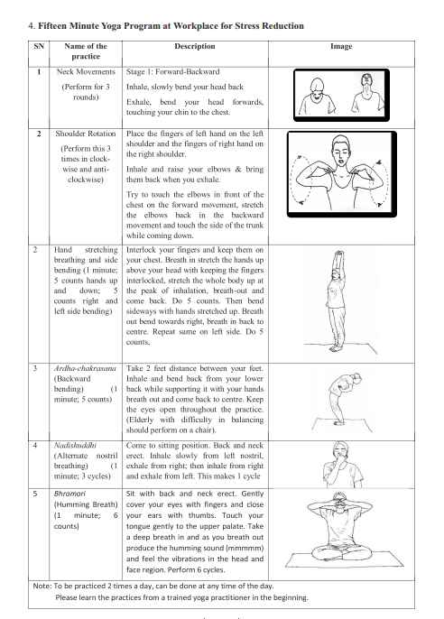

```{r setup, include=FALSE}
knitr::opts_chunk$set(echo = TRUE)
```


_Disclaimer: This document is managed by [what_a_sham](https://www.instagram.com/what_a_sham/), who is not a mental health care professional. This is a community project to help citizens in a time of need. This document contains a compilation of links, and material from cited sources. If you want to help expand or improve this page, please get in touch with [what_a_sham](https://www.instagram.com/what_a_sham/) (Instagram) or send a [pull request]((https://github.com/shambhavipriyam/covid_communityMH)) (Github)._

## If you are in need of immediate help

**Behavioural Health: Psycho-Social Toll free helpline (India) – 08046110007 (MOHFW – all days)**

Other helpline numbers:

  - Aasra – (numbers also by state on website): http://www.aasra.info/helpline.html  - +91 9820466726 - (24 hours) 
  - iCall: https://icallhelpline.org/ - +91 9152987821 - (10am - 8pm Monday to Saturday)
  - Mpower: https://mpowerminds.com/oneonone - 1800-120-820050 (24 hours)
  - Parivarthan - https://parivarthan.org/ - +91 7676602602 - (1pm – 10pm Monday to Friday)
  - Sneha - https://snehaindia.org/new/ - +91 44 24640050 - (10am – 10pm all days)


**If you are in need of therapy/counseling, but are unable to find help, fill out this form and [what_a_sham](https://www.instagram.com/what_a_sham/) will get in touch with you to find a resource person or mental health professional.**
[[LINK](https://forms.gle/1BwEE94jK5uoBAtX6)]

*If you are a social worker or clinical psychologist, please DM [what_a_sham](https://www.instagram.com/what_a_sham/) in order to help or volunteer.*


## Understanding Stress and Anxiety 
Many of us and our friends may be facing stress and trauma because of the pandemic. 
Whether you are suffering from the illness during this time, caring for one, facing loss of family, or just feel helpless hearing the news of loss around you, COVID-19 can affect your mental health in multiple ways. 

Make sure to check on your friends and ensure they are healthy mentally during this time. This would be applicable specifically TO older people in your family, domestic staff, and those less privileged who often brush off these problems.

Caring for your mental health and of those around you can help you become more resilient. 
Taking care of yourself can also help you care better for others.

### Stress can manifest itself in the following ways
From [Centers for Disease Control and Prevention](https://www.cdc.gov/coronavirus/2019-ncov/daily-life-coping/managing-stress-anxiety.html)

  > 1. Feelings of fear, anger, sadness, worry, numbness, or frustration.
  > 2. Changes in appetite, energy, desires, and interests.
  > 3. Difficulty concentrating and making decisions.
  > 4. Difficulty sleeping or nightmares.
  > 5. Physical reactions, such as headaches, body pains, stomach problems, and skin rashes.
  > 6. Worsening of chronic health problems.
  > 7. Worsening of mental health conditions.
  > 8. Increased use of tobacco, alcohol, and other substances.

### Mental Health Matters 
[Video from Ministry of Health and Family Welfare](https://www.youtube.com/watch?v=rJENzEE4xBE) (July 2020)

[](https://www.youtube.com/watch?v=rJENzEE4xBE)


### Where in your body is _stress_?
From [Doing What Matters in Times of Stress](https://apps.who.int/iris/bitstream/handle/10665/331901/9789240003910-eng.pdf?sequence=1&isAllowed=y)

<div align="center">
<figure>

<figure>
</div>


<div align="center">
<figure>

<figure>
</div>


## Self-help 

Here are some things you can do on your own and tell others to do:

### Yoga for stress 
From [MOHFW](https://www.mohfw.gov.in/pdf/HCWMentalHealthSupportGuidanceJuly20201.pdf)


<div align="center">
<figure>

<figure>
</div>


### App based meditation
1. Headspace – 10 min meditation to reframe stress [(video)](http://youtube.com/watch?v=sG7DBA-mgFY). [Download app.](https://www.headspace.com/headspace-meditation-app)
2. Calm – Take a deep breath [(video playlist)](https://www.youtube.com/watch?v=zilmlTO5i9Q&list=PLgdxvG3Ulbie6EIEToXVPV73_Zf2DiCLl). [Download app.](https://www.calm.com/)


## Get in touch with mental health professionals 
You can contact the persons mentioned here directly and schedule a conversation with them. You can also fill the form and we will get in touch with you. [[LINK](https://forms.gle/1BwEE94jK5uoBAtX6)]

1. [Mrigtrishna Rathore](https://www.instagram.com/mrigtrishna_rathore/) - _What you can therapy sessions_<br />
  Contact: [Instagram](https://www.instagram.com/mrigtrishna_rathore/)
2. [Prachi Desai Shah](https://www.instagram.com/prachidesai1410/) <br />
  Contact: Email - prachidesaishah@gmail.com, Phone - +91 99875 94548

### Other low-cost therapy 
1. Therapize.india: Free 1:1 online counselling sessions conducted in English. Registation open begining of the week. [REGISTRATION LINK](https://calendly.com/therapize/probono?month=2021-05) **NO dates in May**
2. [Dr. Prerna Kohli](https://www.instagram.com/drprernakohli.in/): One session of free counseling, by associates of Dr. Kohli, after which you can take additional counseling at very nominal charges. <br />
[REGISTRATION LINK](https://www.mindtribe.in/free-counseling)
3. [With Love We Care](https://withlovewecare.in/): Free mental health support. <br />
Email: info@withlovewecare.in, WhatsApp: +91 9771413646. Time: 10am-12pm, 5pm-9pm
4. [Mind Wellness India](http://mindwellnessindia.com/): **Free counseling for frontline workers**. <br />
Email - mindwellnesscounselling@gmail.com, SMS: +91 9830463635
5. [The Sister's Block](https://www.instagram.com/we.thesistersblock/): Counseling service at Rs. 100 per session. <br />
[REGISTRATION LINK](https://forms.gle/PGP2KGCMjjj8XHQD8)

## Important Resources 
Some resources you can read to get a better understanding of how to get help for yourself and offer help to others: 

1. [Doing What Matters in Times of Stress](https://apps.who.int/iris/bitstream/handle/10665/331901/9789240003910-eng.pdf?sequence=1&isAllowed=y) (WHO) – _Illustrated guide on dealing with stress_
2. CDC guidelines on [Coping with Stress](https://www.cdc.gov/coronavirus/2019-ncov/daily-life-coping/managing-stress-anxiety.html) – _compilation of resources and tips_ 
3. **Conversations can help** – Here is [_how to have conversations with others_](https://howrightnow.org/talk) (video)
4. Tips to face [COVID related anxiety](https://www.allencomm.com/courses/covid19_5_tips_to_face_your_anxiety/index.html) – _5 tips on dealing with anxiety_
5. Caring for older [adult’s mental health](https://afsp.org/story/covid-19-we-must-care-for-older-adults-mental-health) – _short article (3 mins)_ 
6. Emotional and [spiritual care](https://3hb3e83lj75i1iikjx1wkj2o-wpengine.netdna-ssl.com/wp-content/uploads/light_our_way_2018_final-published-copy.pdf) during disaster – _guide for volunteers and responders_
7. Managing family [conflict with intimate partners](https://www.cstsonline.org/assets/media/documents/CSTS_FS_Managing_Family_Conflict_While_Home.pdf) – _2-page pamphlet with tips_
8. Protecting [early childhood impacts](https://developingchild.harvard.edu/resources/protecting-our-children-covid-19s-impact-on-early-childhood-and-aces/?utm_source=newsletter&utm_medium=email&utm_campaign=september_2020) - _webinar_
9. Supporting [children and yourself](https://46y5eh11fhgw3ve3ytpwxt9r-wpengine.netdna-ssl.com/wp-content/uploads/2020/04/COVID-19_for_families_FINAL.pdf) – _3-page handout_ 
10.	**For parents**: [families and children](https://childmind.org/coping-during-covid-19-resources-for-parents/) – _collection of resources_
11.	Helping [family with stress](https://www.atsdr.cdc.gov/emes/health_professionals/documents/relocationstress_508.pdf) – _short handout_
12.	**For healthcare workers**: [Self-Care Modules](https://files.asprtracie.hhs.gov/documents/aspr-tracie-dbh-self-care-for-healthcare-workers-modules-description-final-8-19-19.pdf) – _handout with links to important resources_
13.	[Managing mental illness in Hospitals](https://www.mohfw.gov.in/pdf/GuidelinesforDeliveryofMentalMentalHealthcareServicesduringtheCOVID19.pdf) – _MOHFW guideline_ 
14.	[Guide for general medical and mental healthcare settings](https://www.mohfw.gov.in/pdf/COVID19Final2020ForOnline9July2020.pdf) – _MOHFW guideline_
15.	**For community leaders**: [Grief leadership](https://www.cstsonline.org/assets/media/documents/CSTS_FS_Grief_Leadership_During_COVID19.pdf) – _2-page pamphlet with tips_
16.	**For faith leader**: _webinar_ on [mental health and anxiety management](https://www.youtube.com/watch?v=8HJ7q-xs7_U) 


## Donate to MH Campaigns
Support Mental Health Needs of Covid-19 Workers - by One Future Collective <br />
Campaign - [LINK](https://www.ourdemocracy.in/Campaign/covid19mentalhealth) <br />
More information on [One Future Collective](https://drive.google.com/file/d/1KKsC1mKVpdM5bVbvEuqzydllfCh8T05h/view).